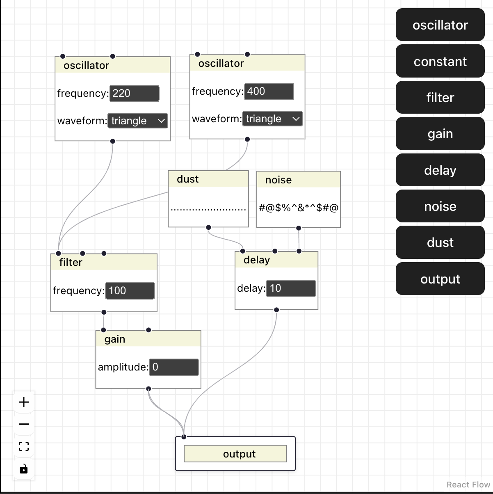

# Instrument Patcher

This is a demo of an instrument patcher using the Web Audio API and React Flow.

If you do not need the graphical patching environment, I recommend using [ToneJS](https://github.com/Tonejs/Tone.js) as this is an excellent library that wraps elements of the Web Audio API alongside various other abstractions.

I am currently transitioning out of using ToneJS for this application, since I have had some issues with connections and there are a few things I would like to do differently. 

However, I don't wish to completely re-invent the wheel here, and compatibility could be built back in at a later date.

