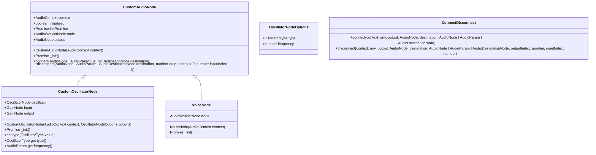

# Example class diagram (work in progress)

```mermaid
classDiagram
    class CustomAudioNode {
        +AudioContext context
        +boolean initialized
        +Promise<void> initPromise
        +AudioWorkletNode node
        +AudioNode output
        +CustomAudioNode(AudioContext context)
        +Promise<void> _init()
        +connect(AudioNode | AudioParam | AudioDestinationNode destination)
        +disconnect(AudioNode | AudioParam | AudioDestinationNode destination, number outputIndex = 0, number inputIndex = 0)
    }

    class CustomOscillatorNode {
        +OscillatorNode oscillator
        +GainNode input
        +GainNode output
        +CustomOscillatorNode(AudioContext context, OscillatorNodeOptions options)
        +Promise<void> _init()
        +set type(OscillatorType value)
        +OscillatorType get type()
        +AudioParam get frequency()
    }

    class NoiseNode {
        +AudioWorkletNode node
        +NoiseNode(AudioContext context)
        +Promise<void> _init()
    }

    CustomAudioNode <|-- CustomOscillatorNode
    CustomAudioNode <|-- NoiseNode

    class OscillatorNodeOptions {
        +OscillatorType type
        +number frequency
    }

    %% External utility functions
    class ConnectDisconnect {
        +connect(context: any, output: AudioNode, destination: AudioNode | AudioParam | AudioDestinationNode)
        +disconnect(context: any, output: AudioNode, destination: AudioNode | AudioParam | AudioDestinationNode, outputIndex: number, inputIndex: number)
    }
```